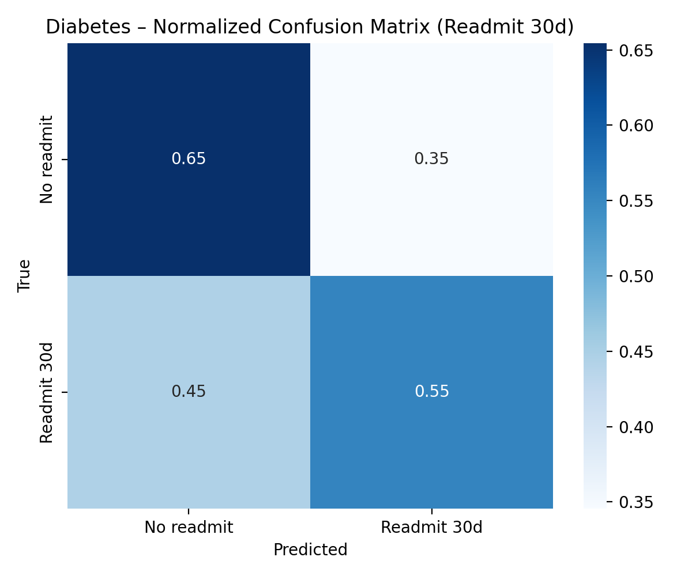
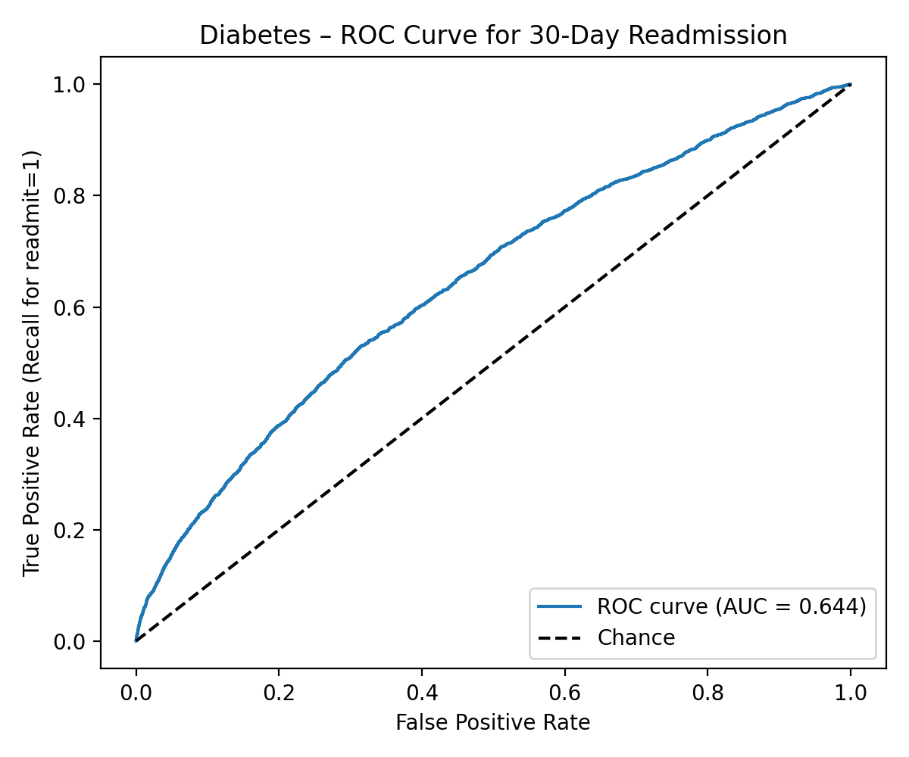
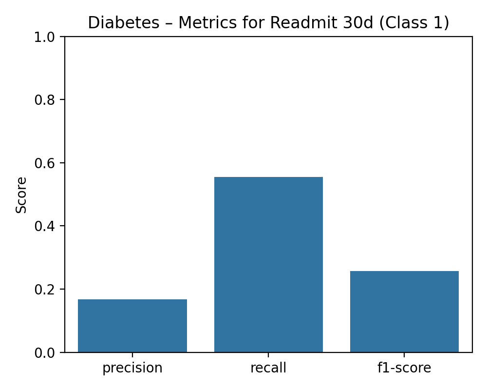
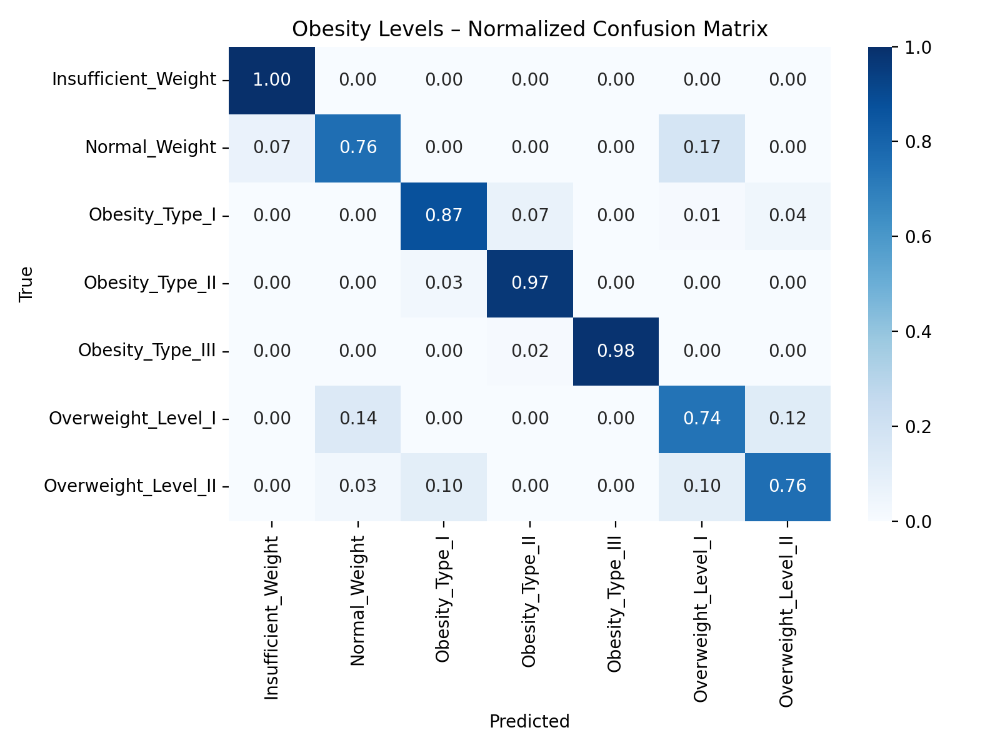
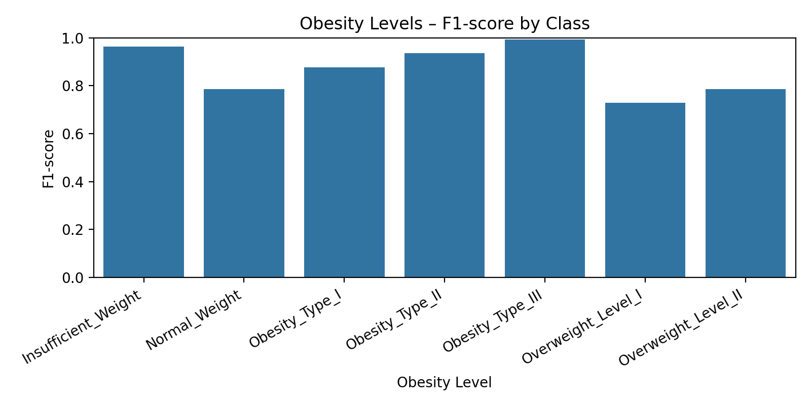
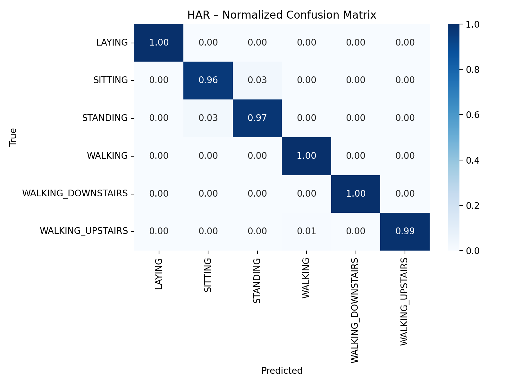
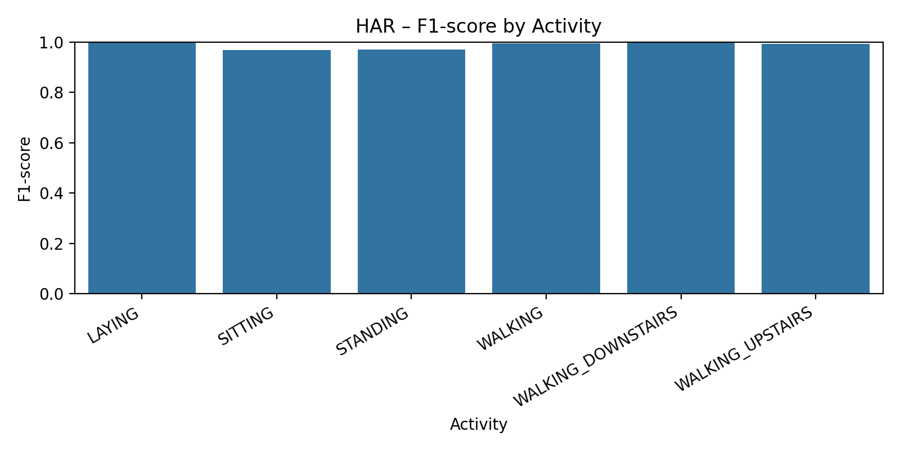
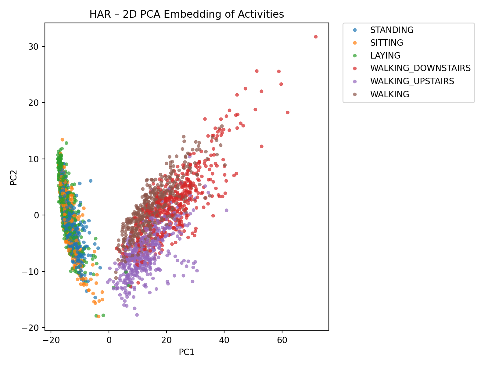

Here’s a cleaned-up, academic, “portfolio-ready” `README.md` that uses badges and actually shows your figures.
Paste this **as the whole contents** of `README.md` (no extra backticks at the top or bottom).

---

# DM UCI ML Repo – Clinical Risk & Human Activity Benchmarks

End-to-end machine-learning lab built on three classic UCI datasets:

* Inpatient **diabetes readmission** (1999–2008, 130 US hospitals)
* **Obesity levels** from nutrition and lifestyle factors
* **Human Activity Recognition (HAR)** using smartphone sensors

Each sub-project is fully reproducible:

* `01_fetch_and_save.py` – fetch / clean / merge data
* `02_baseline_model.py` – baseline model with proper preprocessing
* `03_*_analysis_plots.py` – diagnostic plots and “story” figures saved under `reports/figures/`

[](https://www.python.org/)
[](https://pandas.pydata.org/)
[](https://scikit-learn.org/)
[](https://matplotlib.org/)
[](https://seaborn.pydata.org/)

---

## Repo layout

* `diabetes_readmission_uci/` – 30-day readmission classification
* `obesity_levels_uci/` – multi-class obesity level prediction
* `har_smartphones_uci/` – human activity recognition from smartphone data

Each project folder has the same structure:

* `data/` – local CSV snapshots (features, targets, merged)
* `src/01_fetch_and_save.py` – pulls from UCI (or local zip) and builds `*_merged.csv`
* `src/02_baseline_model.py` – logistic-regression baseline with `ColumnTransformer` preprocessing
* `src/03_*_analysis_plots.py` – confusion matrices, ROC curves, PCA, F1 plots
* `reports/figures/` – saved PNGs used below

---

## How to run everything

From the repo root:

1. Create and activate a virtual environment (once):

```bash
python -m venv .venv
# Windows PowerShell
.\.venv\Scripts\activate
pip install -r diabetes_readmission_uci\requirements.txt
```

*All three projects share this requirements file.*

2. Diabetes – fetch + baseline + plots:

```bash
cd diabetes_readmission_uci
python .\src\01_fetch_and_save.py
python .\src\02_baseline_model.py
python .\src\03_diabetes_analysis_plots.py
```

3. Obesity – fetch + baseline + plots:

```bash
cd ..\obesity_levels_uci
python .\src\01_fetch_and_save.py
python .\src\02_baseline_model.py
python .\src\03_obesity_analysis_plots.py
```

4. HAR – fetch (from local zip) + baseline + plots:

```bash
cd ..\har_smartphones_uci
python .\src\01_fetch_and_save.py
python .\src\02_baseline_model.py
python .\src\03_har_analysis_plots.py
```

Scripts are designed to be re-runnable: if the data already exist, they overwrite or reuse the same CSVs and figures.

---

## Project 1 – Diabetes 30-Day Readmission

**Folder:** `diabetes_readmission_uci/`
**Goal:** Predict whether an inpatient diabetic encounter will be readmitted within 30 days (binary classification).

### Key figures

**Normalized confusion matrix**



The model is very accurate for the majority “no readmission” class and misses many true readmissions. This is the classic high-accuracy / low-sensitivity pattern in imbalanced clinical data.

**ROC curve**



The ROC curve sits comfortably above the diagonal “chance” line, confirming that there is real signal. Different probability thresholds will strongly change the balance between missed readmissions and false alarms.

**Positive-class metrics (readmit = 1)**



Precision, recall, and F1 for the readmission class make the trade-offs explicit: the baseline logistic model is conservative and under-detects readmissions, which is unacceptable if the priority is patient safety rather than workload minimization.

### Interpretation

* Dataset is **heavily imbalanced**; most patients are not readmitted within 30 days.
* Logistic regression with balanced class weights and proper preprocessing still struggles to achieve high recall on readmissions.
* Clinical use would require:

  * Careful threshold tuning driven by cost of missed readmissions vs false positives.
  * Stronger models (e.g., gradient boosting) and richer features (labs, vitals, prior utilization).

This project functions as a transparent baseline and a controlled environment for experimenting with risk thresholds and calibration.

---

## Project 2 – Obesity Levels

**Folder:** `obesity_levels_uci/`
**Goal:** Multi-class classification of obesity category from diet, activity, and demographic variables.

### Key figures

**Normalized confusion matrix**



Misclassifications occur mainly between adjacent categories (e.g., overweight vs obesity type I), which matches the inherently fuzzy boundaries of BMI-like labels.

**Per-class F1 scores**



The model performs best for clearly separated extremes (normal weight and highest obesity levels) and worst where categories are clinically similar.

### Interpretation

* Features capture **lifestyle patterns** (diet, activity, habits) rather than direct clinical biomarkers.
* One-hot encoding + balanced logistic regression:

  * Distinguishes “obviously healthy” and “obviously unhealthy” profiles effectively.
  * Shows expected ambiguity for intermediate states where measurement error and labeling noise are highest.
* This is a good sandbox for:

  * **Ordinal** modeling (respecting the ordered nature of obesity levels).
  * Fairness and subgroup analysis across age, sex, or socioeconomic markers.

---

## Project 3 – Human Activity Recognition (Smartphones)

**Folder:** `har_smartphones_uci/`
**Goal:** Predict human activity (walking, sitting, standing, lying, etc.) from smartphone accelerometer/gyroscope features.

### Key figures

**Normalized confusion matrix**



The baseline model is strong on clearly distinct movements (e.g., walking vs lying) and weaker on posturally similar states (sitting vs standing), which often look similar to the sensors.

**Per-activity F1 scores**



Activities with unique motion signatures achieve very high F1; more static activities show lower scores, revealing where additional temporal modeling is needed.

**PCA embedding of feature space**



The PCA projection shows clusters for several activities, with partial overlap for others. This visually confirms where the feature space cleanly separates behavior and where it does not.

### Interpretation

* The UCI HAR dataset exposes carefully engineered **time- and frequency-domain features**.
* Even a plain logistic regression with scaling produces a surprisingly strong baseline, validating the feature engineering.
* Remaining errors are concentrated where:

  * Activities are posturally similar.
  * Smartphone orientation or placement introduces ambiguity.

This project serves as a baseline HAR benchmark and a clean starting point for sequence models (CNNs, RNNs, transformers) that operate directly on raw sensor streams.

---

## Design choices across all projects

* **Consistent preprocessing**
  Shared `ColumnTransformer` pipelines handle categorical and numeric features explicitly, avoiding leakage and making cross-dataset comparisons meaningful.

* **Transparent baselines**
  Logistic regression is used deliberately as a first-line model:

  * Interpretable coefficients and odds ratios.
  * Fast training and straightforward diagnostics.
  * Clear baselines that more complex models should be expected to beat.

* **Diagnostics over single numbers**
  The emphasis is on *why* a model behaves as it does:

  * Per-class precision, recall, and F1 rather than a single accuracy value.
  * Confusion matrices and ROC curves for error structure.
  * PCA embeddings for qualitative separation in feature space.

---

## Possible extensions

* Replace logistic regression with tree-based methods (Random Forest, XGBoost, LightGBM) or neural networks.
* Calibrate and compare decision thresholds for readmission risk under explicit cost assumptions.
* Introduce ordinal models for obesity levels to respect clinical ordering.
* Apply sequence models directly to the raw HAR time series for gait and posture analysis.
* Add SHAP or other explainability tools to identify features that drive risk and misclassification.

---

## How to describe this work

> Developed an end-to-end machine-learning lab using three UCI datasets (hospital diabetes readmission, obesity levels, and smartphone-based human activity recognition). Implemented reproducible data pipelines, transparent logistic-regression baselines, and diagnostic visualizations (confusion matrices, ROC curves, PCA) using a shared, research-friendly project structure.

---
